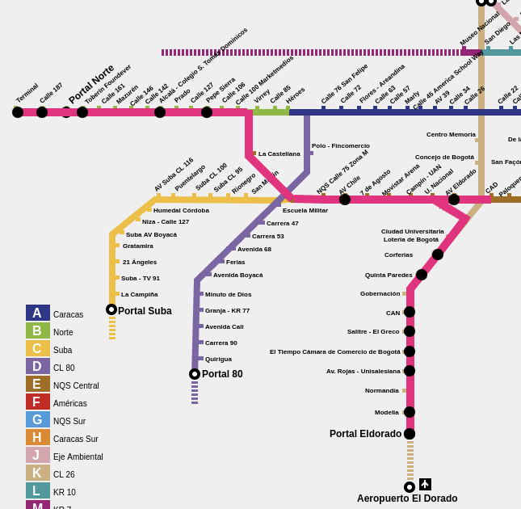
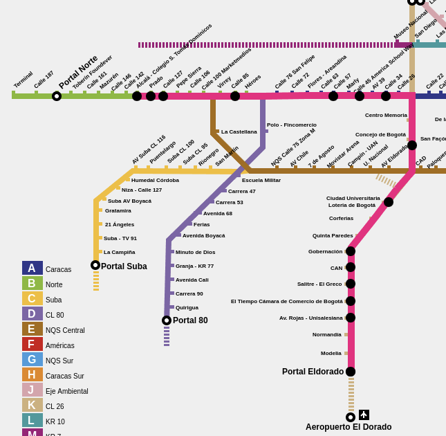

# TransMelo

The idea is to create a reinforcement learning (RL) alrogithm that optimizes the deployment of buses that cover the same stations as the routes B16, K16, B23 and K23 in the TransMilenio system. 

## Routes

The routes will have a slight twicht, namely, that the K16 route can start from Portal Norte or from Alcalá. This is to force the agent to take a decision on making a U-turn after Alcalá (to deploy a K23 route) or to continue to Portal Norte (to deploy a K16 route). Therefore, the routes will be as follows:

- K16: Portal El Dorado (starting from Portal Norte or from Alcalá)
- K23: Portal El Dorado (starting from Portal Norte or from Alcalá)
- B16: Portal Norte (starting from Portal El Dorado)
- B23: Portal Norte (starting from Portal El Dorado)

To have a better understanding of the routes, you can take a look at [this map](https://www.transmilenio.gov.co/publicaciones/150402/publicacionesmapa-interactivo-de-transmilenio/) and the two images below, corresponding, respectively, to the stations of the aforesaid routes.

*K16/B16*

*K23/B23*

## Optimization

The deployment of buses will be optimized using a Proximal Policy Optimization (PPO), a reinforcement learning (RL) algorithm.

### What is PPO?

In any RL algorithm, the agent (an entity with information about the current state of the environment and the ability to take decisions depending on the current state) learns to maximize a reward function by interacting with an environment. The agent takes the state of the environment and outputs the probability of doing certain actions, depending on the output of the policy. This function's parameters will be optimized using a neural network

> The policy is a given function or a mathematical way of expressing the decision-making rules for the agent in the given environment (it is sometimes refered too as the parameters of such function).

The goal of the agent is to learn the best parameters for the policy that maximize the expected reward, improving a decision-making process.

Using an analogy, you may think of the policy as a lasagna recipe, the agent as an apprentice chef, and the PPO the Italian grandma that teaches the apprentice how to make the lasagna better.

### Implementation in TransMelo

The agent will have:
- Three goals:
  - Pick up as many passengers as possible.
  - Do it in the least amount of time.
  - Use the least amount of gas (if the time allows us to do it).

- Two actions:
  - Deploy a bus in one of the three starting points (Portal Norte, Portal El Dorado and Alcalá).
  - Make a U-turn between Alcalá and 142th street (to have one more available bus that can be deployed as a K23 route) or continue straight (to have one more available bus that can be deployed as a K16 route). (a constraint could be added regarding how many busses can there be in-wait to be deployed)

- Four states:
  - The number of passangers at each station at the current time and three minutes before, within a certain interval of time (any, in theory, but due to efficiency, we may need to choose a specific one).
  - The time it takes to go from one station to another.
  - And the amount of gas it takes to go from one station to another (optional).
  - The location of each bus every three minutes within the interval of time.

Therefore, the environment will be:
- The stations and their connections (time, gas and physical transtiways) of the K zone up to Centro de Memoria starting from Portal El Dorado, the E zone between Av. El Dorado and La Castellana, the entire B zone and the A zone between 26th street and 76th street (all of them, excluding the stations that are not covered by any of the routes mentioned).
- The number of passangers at each station for every three minutes of a certain interval of time.
- The location of each bus for every three minutes of a certain interval of time.

And finally, the reward function will take the following into account:
- The number of passangers picked up.
- The time it took to pick up the passangers.
- The amount of gas used to pick up the passangers (optional).
- The number of buses deployed.

### How will the algorithm work?

It will start with a given policy or reward function (to be defined), the initial state of the environment (at the start time) random times to deploy each bus, and random choices regarding whether to make a U-turn if possible or not. 

After the first episode (simulation), it will know the output of the policy and adjusts the weights of the neural network according to a loss function and its gradient descent. Once adjusted, the neural network will suggest new policy, and the process will be repeated until the agent finds the best policy to maximize the reward function.

### To-do

- [ ] Model the transitway as a graph (this includes gathering info about passangers at each station, and time and distance between stations).
- [ ] Define the environment and agent using (Gym).
- [ ] Build the PPO agent (using PyTorch or TensorFlow).
- [ ] Run several episodes and adjust the hyperparameters (the given ones).
- [ ] Compare the results with the current deployment of buses.
